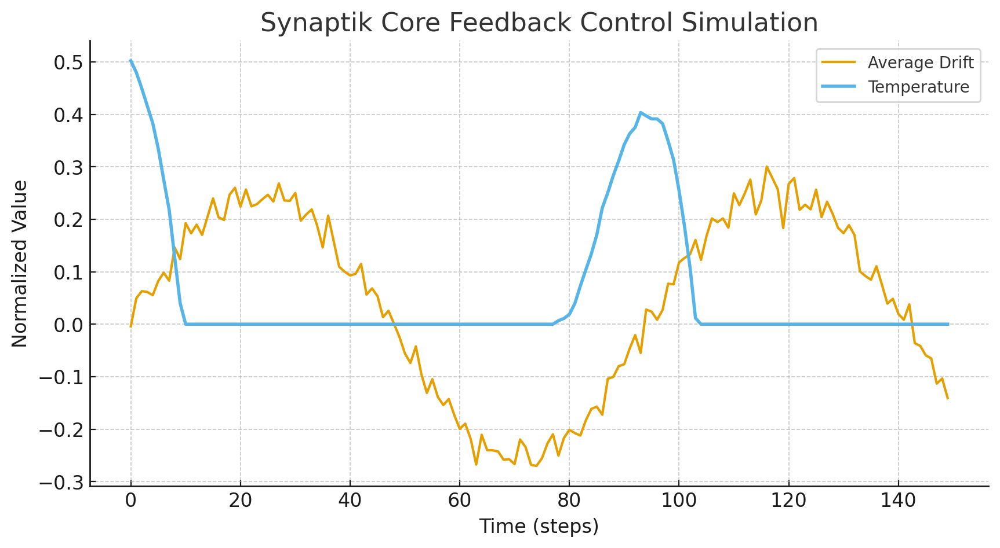
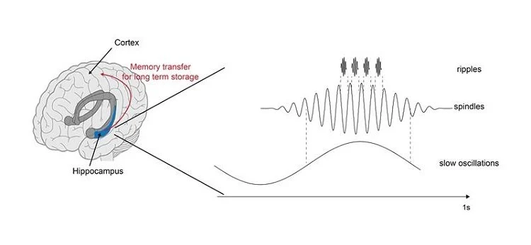

Every intelligent system faces the same problem: remembering too much or too little. The brain solved it with the hippocampus, a living regulator that filters, curates, and stabilizes thought. Synaptik Core brings that same balance to machines, keeping AI memory intentional instead of infinite.

## Why Memory Needs Boundaries

Unregulated memory quickly turns into chaos. Information piles up, context fades, and focus blurs. The human brain avoids this by constantly deciding what to keep and what to release. 

Synaptik Core applies this same biological wisdom to AI systems so they can remember with purpose instead of simply accumulating data.

*Stability is not an accident; it's a conversation between memory and control.*

## How Feedback Keeps Thought in Check

*A continuous feedback loop monitors system state and adjusts memory to maintain cognitive stability.*

Like a conductor keeping an orchestra in time, Synaptik Core listens for drift and brings every signal back into tune.

It monitors its own activity, detects drift, and makes adjustments to restore balance. When context becomes overloaded or irrelevant information builds up, its internal feedback mechanisms bring the system back into alignment.

This is similar to how the hippocampus and cortex communicate. In the brain, rhythmic cycles coordinate learning and recall. In Synaptik Core, structured feedback keeps reasoning stable and memory coherent. 

Both rely on constant dialogue between short-term focus and long-term understanding.

## The Brain's Blueprint for Machine Memory

*Frontal cortex focus, hippocampal gating, and microglial pruning—the biological rhythm Synaptik Core reflects.*

In the human brain:

* The **prefrontal cortex** directs attention, much like an AI’s reasoning engine.
* The **hippocampus** acts as a gatekeeper that determines what becomes lasting memory.
* **Microglia** remove outdated connections to preserve efficiency and clarity.
* **Neural oscillations** synchronize all of these functions to keep thought steady.

Synaptik Core mirrors this pattern, creating an artificial system that learns, prunes, and stabilizes in rhythm with its own activity.

## Memory with Discipline

Human intelligence is not defined by how much it remembers but by how it chooses what to remember. 

The hippocampus enforces this discipline by consolidating the meaningful and letting go of the rest. Synaptik Core brings that same structure to machine cognition. It allows AI to retain what matters, forget what no longer serves, and stay clear-headed even as knowledge expands.

## Controlled Intelligence

An AI that remembers everything becomes noisy. One that forgets too easily loses continuity. Synaptik Core finds balance in the middle, where regulation and memory reinforce each other.

Human memory finds clarity through forgetting. AI must learn to do the same. Synaptik Core stands at that intersection, where structure meets reflection and cognition learns to govern itself.

This is **controlled intelligence**. Memory guided by structure, feedback, and purpose.
